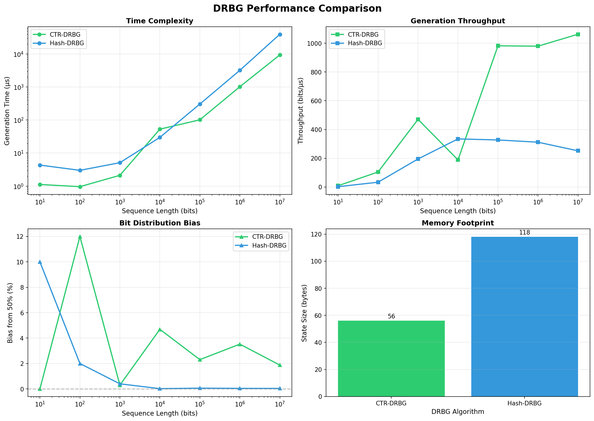

# DRBG Benchmark

A comparative analysis of two Deterministic Random Bit Generator (DRBG) implementations in C++.

## Overview

This project implements and benchmarks two cryptographically secure pseudo-random number generators (CS-PRNGs) as specified by NIST SP 800-90A:

| Algorithm | Based On | State Size |
|-----------|----------|------------|
| **CTR-DRBG** | AES-like block cipher (counter mode) | 56 bytes |
| **Hash-DRBG** | SHA-256 hash function | 118 bytes |

## Results Summary

Performance comparison for sequences from 10¹ to 10⁷ bits:

- **CTR-DRBG**: ~1063 bits/μs throughput, 1.9% bias
- **Hash-DRBG**: ~252 bits/μs throughput, 0.04% bias



## Build & Run

```bash
# Build
make

# Run benchmarks
make run

# Generate plots (requires Python + matplotlib)
make plot

# Clean
make clean
```

## Project Structure

```
├── include/
│   ├── drbg.hpp        # DRBG class definitions
│   └── benchmark.hpp   # Benchmarking utilities
├── src/
│   ├── drbg.cpp        # DRBG implementations (SHA-256, SPN cipher)
│   ├── benchmark.cpp   # Benchmark framework
│   └── main.cpp        # Main program
└── Makefile
```

## Requirements

- C++17 compiler (g++ or clang++)
- Python 3 + matplotlib + pandas (optional, for plots)

## Author

Luca Tam - Sapienza University of Rome  
Cybersecurity Course - Homework 5
